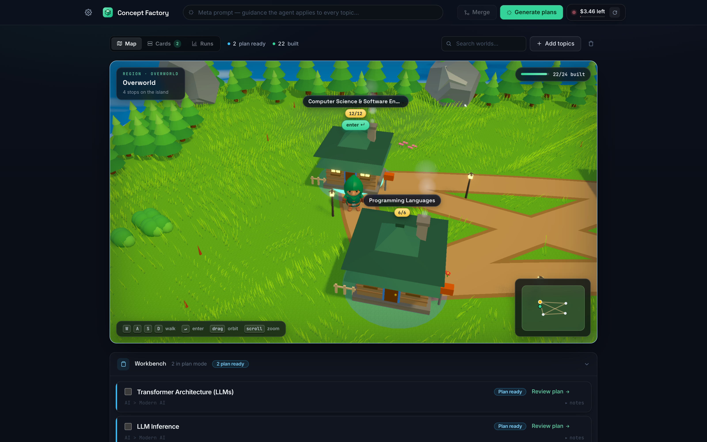
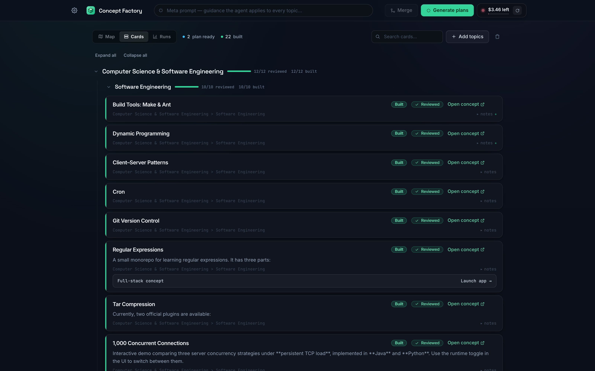
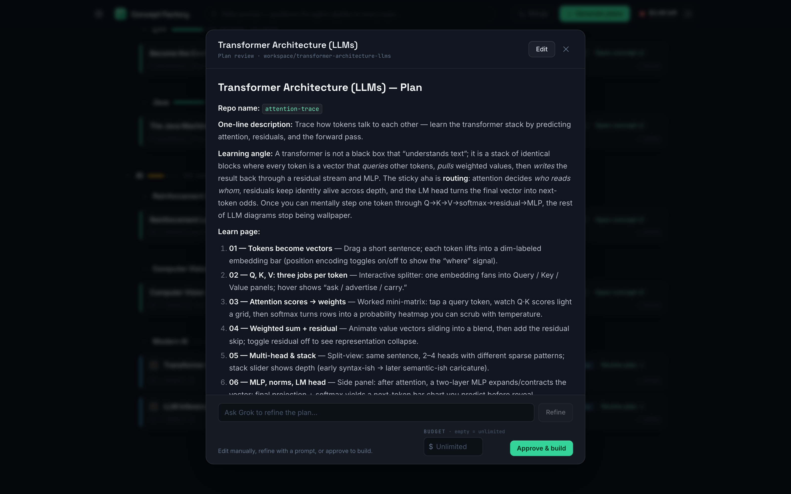
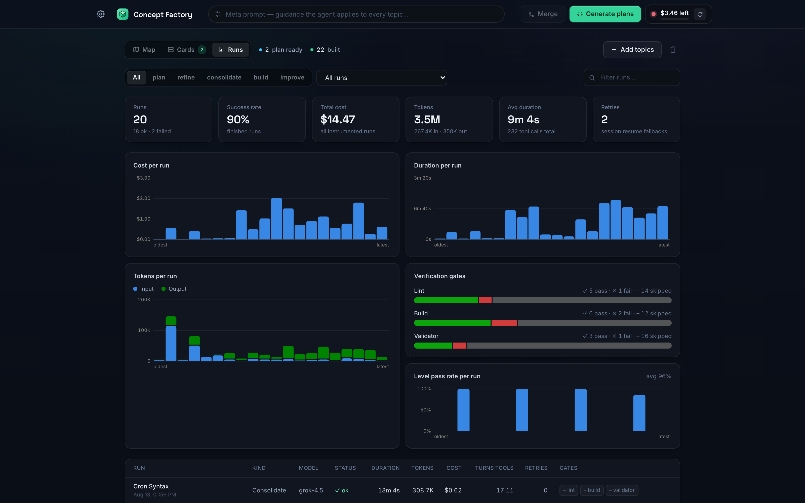
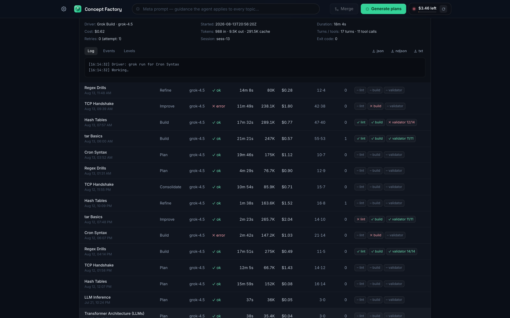
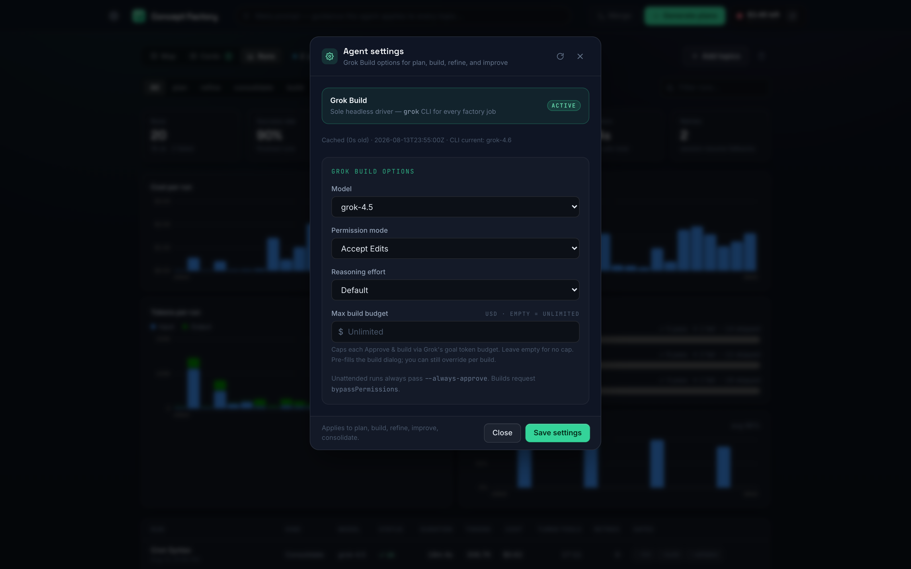
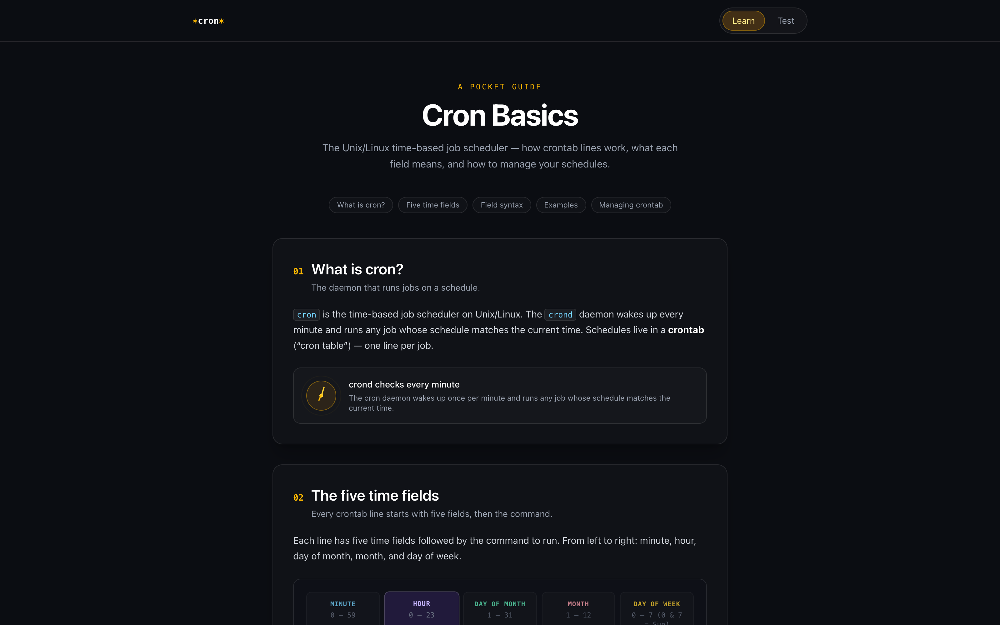

# Concept Factory

An **agentic workflow platform**: a harness that orchestrates parallel headless LLM
agent sessions to plan, generate, verify, and iteratively improve complete web
apps — with a human-in-the-loop review dashboard, independent quality gates, git-based
versioning with one-click revert, and live API spend tracking.

The current output domain is single-concept CS learning apps (an interactive **Learn**
guide plus a **Test** game per topic, e.g. cron, regex, tar), but the harness itself is
domain-agnostic: swap the plan/build prompts and the template and it will factory
anything.

## Tour

**The overworld map** — the default board view. Every topic group is a house on a
Three.js island, every topic a cottage; walk between them with WASD/arrows and press
Enter to open one. The Workbench tray below collects cards still in plan mode, and the
credits HUD (top right) shows the live prepaid balance:



**The card board** — the same library as a grouped card list with pipeline status,
review badges, search, and multi-select consolidation. Full-stack concepts get a
launch control:



**Plan review** — every generated plan is a short, reviewable markdown document.
Edit it, refine it with feedback (re-invokes the agent), or approve it with an
optional per-build dollar budget:



**The Runs dashboard** — every agent run is persisted with structured metrics:
cost, duration, tokens, verification-gate outcomes, and per-level validator pass
rates:



**Run drill-in** — any run expands into its summary (cost, tokens, turns/tool calls,
session, exit code) with the full log, the raw event stream, and one-click
JSON/NDJSON/TXT export:



**Agent settings** — model, permission mode, reasoning effort, and a max build
budget, with dropdown options discovered live from the Grok CLI (never a hard-coded
model list):



**A built concept** — served at `/concepts/<slug>/` with an injected widget for
in-app improve requests and version history:



## How it works

```
┌─────────────────────────────────────────────────────────────────┐
│ Harness (FastAPI backend — owns all state, spawns everything)   │
│                                                                 │
│  topic lifecycle:  none → queued → planning → plan ready        │
│                    → building → built   (or error)              │
│                                                                 │
│  ┌───────────────────────┐   ┌──────────────────────────────┐  │
│  │ Generator agents      │   │ Verification & serving       │  │
│  │ headless Grok CLI,    │   │ harness re-runs lint/build   │  │
│  │ one session per topic,│   │ itself, patches the router   │  │
│  │ concurrency-capped    │   │ base, finalizes a bundle,    │  │
│  │ thread pool, hard     │   │ serves it at /concepts/<slug>│  │
│  │ wall-clock timeouts,  │   │ — never trusts the agent's   │  │
│  │ NDJSON stream → live  │   │ self-reported success        │  │
│  │ telemetry in the UI   │   └──────────────────────────────┘  │
│  └───────────────────────┘                                     │
└───────────────┬─────────────────────────────────────────────────┘
                │
        ┌───────┴────────┐
        │ Dashboard       │  React + TypeScript + Tailwind
        │ (frontend/)     │  card board + Three.js-style world map,
        └────────────────┘  plan review/edit, streaming agent logs,
                            per-concept improve chat, version history,
                            credits HUD with budget caps
```

### The pipeline, per topic

1. **Plan.** The harness spawns a headless agent whose only deliverable is a short,
   reviewable `PLAN.md` — repo name, learning angle, section outline, game mechanic,
   sub-concept keys, example levels, accent color. Cheap to generate, cheap to reject.
2. **Review.** You read, edit, or refine the plan in the dashboard
   (reject-with-feedback re-invokes the agent with your comments). Multiple plans can
   be **consolidated** into one unified plan for a combined app.
3. **Build.** On approval, the harness copies the house template into the topic's
   workspace and spawns a build session. Agents are confined to their workspace and
   forbidden (by prompt contract *and* by design — see below) from touching git or
   credentials.
4. **Verify.** The harness independently runs `npm install`, `lint`, and `build`,
   patches the router basename for sub-path serving, and finalizes a production
   bundle. Disk is the source of truth: status is reconciled against what actually
   exists in the workspace, not against what any agent claimed.
5. **Serve & iterate.** Built concepts are served at `/concepts/<slug>/` with an
   injected widget for in-app improve requests and version history. Improvement
   prompts run against the same session; every change lands as a backend-owned git
   commit, so any version can be restored (and re-served instantly — built bundles
   are committed too) with one click.

### Design decisions worth knowing

- **Never trust the agent's self-report.** Agents are instructed to self-verify, but
  the harness re-runs every gate itself before a concept is marked built. `is_built()`
  checks the workspace on disk, not a persisted status enum.
- **Agents never touch git or secrets.** All commits are made deterministically by the
  backend (`backend/agent/gitops.py`), which also hides synthetic maintenance commits
  (reverts, protective snapshots) from the user-facing history. The publishing design
  (see `meta-agent/ARCHITECTURE.md`) keeps tokens structurally outside the agent
  environment: minimal spawned env, and a plain non-agent push worker gated on
  explicit human approval.
- **Cost is a first-class signal.** The credits HUD reads the xAI management API for
  the real prepaid balance, tracks per-session spend, and enforces a user-set budget.
- **Skill-based generation spec.** The house style lives in a progressive-disclosure
  skill (`meta-agent/.claude/skills/concept-repo-builder/`) — spec, style guide, game
  design rules, and a review checklist — with a condensed version embedded in the
  headless prompts so ~parallel runs stay cheap. `meta-agent/README.md` documents why
  a skill beats always-on project rules here.
- **Resilient headless runs.** Concurrency-capped executor, per-run wall-clock kill
  timers, session-resume with automatic fresh-session fallback, and NDJSON stream
  coalescing so the dashboard shows live agent narration.
- **Every run is instrumented and persisted.** Each plan/build/improve run writes
  `backend/runs/<run_id>/` — `run.json` (duration, tokens in/out, dollar cost,
  driver+model, turns/tool calls, retries, verification-gate outcomes),
  `events.ndjson` (the raw agent stream, replayable in other tools), and `log.txt`
  (the human-readable session log). The dashboard's **Runs** view charts cost,
  duration, tokens, gate pass/fail, and per-level validator pass rates, with
  drill-in log/event viewers and one-click JSON/NDJSON/TXT export
  (`GET /api/runs`, `/api/runs/{id}/export`). Gates are harness-run: `npm run
  lint`, the production build, and a validator that auto-plays every game level's
  canonical answer through the concept's own pure `checkAnswer`.
- **Full-stack concepts too.** Concepts with their own backends run on demand from
  copy-on-write runtime copies on remapped ports (`backend/launcher.py`).

## Layout

```
concept-factory/
├── backend/
│   ├── main.py       # FastAPI app assembly
│   ├── routers/      # HTTP surface: topics, settings+credits, runs, concepts
│   ├── store.py      # topic state models + data.json persistence
│   ├── jobs.py       # background plan/build/improve/revert job runners
│   ├── agent/        # driver package: settings, catalog discovery, prompts,
│   │                 # Grok CLI execution, git ops, verification gates, xAI API
│   ├── runs.py       # per-run instrumentation (metrics, events, logs)
│   └── tests/        # pytest suite
├── frontend/         # React + Vite + TypeScript + Tailwind dashboard
├── meta-agent/       # generation skill, house-style template, architecture notes
├── docs/screenshots/ # the images in this README
└── launch.sh         # starts backend + frontend together
```

## Quick start

**Prerequisites**

- Grok CLI (`grok` binary) on your `$PATH` (or set `GROK_BIN=/path/to/grok`). Run `grok login` once.
- `XAI_API_KEY` in your shell environment (or in `~/.grok/config.toml`).
- `XAI_MANAGEMENT_API_KEY` (create a Management Key at https://console.x.ai → Settings → API Keys). Optional: `XAI_TEAM_ID`.
- Node.js 20+ and Python 3.9+.

```bash
# One command to rule them all
./launch.sh
```

This creates a Python venv, installs deps, runs `npm install` in frontend/, and starts the FastAPI backend (port 8000) + Vite dev server (port 5173).

- **Dashboard**: http://localhost:5173 (3D overworld + plan review + Runs metrics)
- **Backend API docs**: http://localhost:8000/docs
- **Stop**: Ctrl+C in the terminal (kills both processes cleanly)

State lives in `backend/data.json`. All generated concepts land in `backend/workspace/`.

If port 8000 is taken, run the backend elsewhere and point the Vite proxy at it:
`uvicorn main:app --port 8001` plus `CF_BACKEND_URL=http://localhost:8001 npm run dev`.

### Generation internals worth knowing

- **Project skill**: The `concept-repo-builder` skill (in `meta-agent/.claude/skills/`) is the house-style spec the harness condenses into every generation prompt. See `meta-agent/README.md`.
- **Plan mode**: Cards whose plan hasn't been approved yet collect in the floating **Workbench** tray on the map view, so plan review never gets lost behind the 3D board.
- **CLI help cache**: The backend caches `grok --help` output keyed by binary fingerprint so settings-catalog discovery costs zero spawns at steady state (see `backend/agent/catalog.py`).

## Troubleshooting

**Common issues & fixes**

- **"No Grok binary found"**: Run `which grok` or set `GROK_BIN=$(which grok)`. The settings catalog probes `grok --help`.
- **Credits HUD shows $0**: Double-check `XAI_MANAGEMENT_API_KEY`. Try the Refresh button in Settings.
- **Builds fail on first run**: `npm install` can be slow on a cold cache. Check the run's log in the Runs dashboard.
- **Agent loops forever**: Wall-clock timeouts in `backend/agent/driver.py` kill runaway sessions (7 min for plans, 30 min for builds). Check `backend/runs/<id>/log.txt`.
- **Dashboard stuck on "planning"**: Refresh the page or restart `./launch.sh`. State is reconciled from disk on startup.
- **Permission errors**: The backend passes `--permission-mode` to the Grok CLI. See the Settings modal.

**Keyboard shortcuts**

- `Cmd/Ctrl + Enter` — submit the add-topics intake
- `Esc` — close modals
- On the map view: `WASD` / arrow keys walk, `Enter` opens the nearest stop, `Esc`/`Backspace` goes back up a level

Report issues in the Runs dashboard (export JSON/NDJSON/logs with one click).

## Roadmap

- **Deeper eval harness** — the per-level validator + gate metrics now ship in the
  Runs dashboard; still to come: Playwright screenshot capture of built apps and
  rubric-based scoring against the review checklist
- **Approve → publish worker** — the deterministic, non-agent GitHub push worker
  specified in `meta-agent/ARCHITECTURE.md`
- **Hosted deployment** — public gallery of built concepts, containerized agent runs,
  and gated generation with hard budget caps
- **Model-agnostic driver** — the harness has already run on both Claude Code and
  Grok headless; factoring the driver behind a provider interface is next
